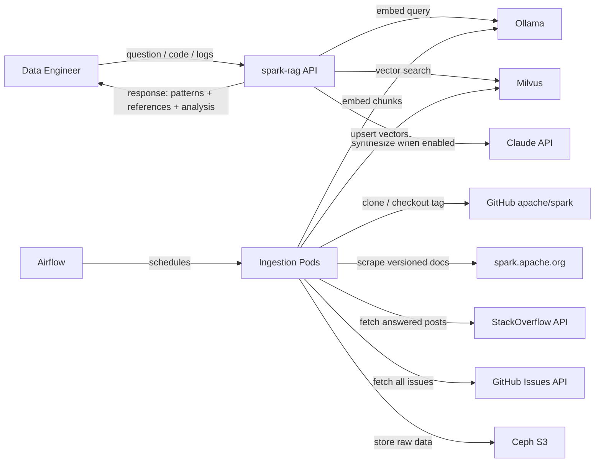
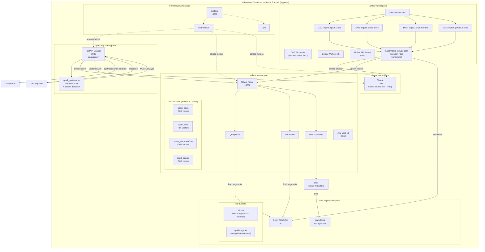
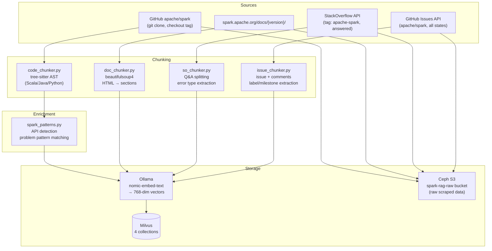
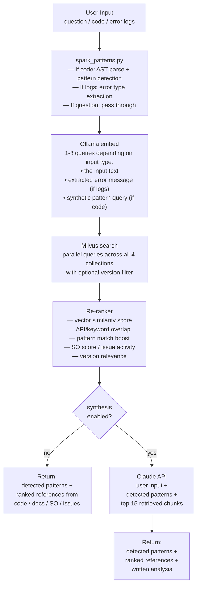

# Architecture

## System Context

The spark-rag system sits between a user (data engineer) and 4 knowledge sources, backed by a K8s infrastructure layer.



## Deployment Topology

Everything runs on a 3-node minikube cluster (Hyper-V). The spark-rag API is the only new deployment; all other services are pre-existing infrastructure components.



## Ingestion Pipeline

4 Airflow DAGs, each following the same pattern: **fetch → chunk → embed → upsert**.

All DAGs use `KubernetesPodOperator` — actual processing runs in ephemeral pods, not in Celery workers. DAGs are deployed to the Airflow DAGs PVC via the dag-processor pod.



### DAG Schedule

| DAG | Source | Version-aware | Schedule | Estimated Duration |
|---|---|---|---|---|
| `ingest_spark_code` | GitHub apache/spark source | Yes — accepts `spark_version` param, checks out corresponding git tag | Manual / weekly | ~2-4h per version (embedding bottleneck) |
| `ingest_spark_docs` | spark.apache.org/docs/{version}/ | Yes — accepts `spark_version` param | Manual / monthly | ~5 min per version |
| `ingest_stackoverflow` | StackExchange API | No — cross-version, extracts version from content | Monthly | ~30 min |
| `ingest_github_issues` | GitHub Issues API | No — cross-version, extracts version from labels/milestone | Weekly | ~1-2h (paginated API, includes comments) |

### Version-Aware Ingestion

Code and docs DAGs accept a `spark_version` parameter:

```
# Trigger for a specific version
airflow dags trigger ingest_spark_code --conf '{"spark_version": "4.1.0", "git_tag": "v4.1.0"}'
airflow dags trigger ingest_spark_docs --conf '{"spark_version": "4.1.0"}'
```

Each chunk is tagged with `spark_version` in Milvus metadata. Re-ingesting a version replaces its chunks (upsert keyed on `spark_version` + `source_id`).

SO and GitHub Issues are cross-version. The chunker attempts to extract version references from content, labels, and milestones — stored as `spark_versions_mentioned` (JSON array) when detectable.

## Query Pipeline



### Query Modes

**Retrieval-only (default)** — no API key needed:
1. Parse input (detect if it's code, logs, or a question)
2. Extract patterns and signals from input
3. Embed 1-3 queries via Ollama
4. Search all 4 Milvus collections in parallel (with optional version filter)
5. Re-rank results combining similarity + metadata signals
6. Return: detected patterns + ranked references (code snippets, doc sections, SO answers, related issues)

**Retrieval + Claude synthesis** — requires `ANTHROPIC_API_KEY`:
- Same retrieval steps 1-5
- Then sends user input + detected patterns + top 15 retrieved chunks to Claude
- Returns everything from retrieval-only mode, plus a written analysis with root cause and recommendations

### Input Type Detection

The query pipeline auto-detects input type to optimize search:

| Input Type | Detection Signal | Embedding Strategy | Collection Weights |
|---|---|---|---|
| **Code** | Parseable by tree-sitter, contains Spark API calls | Embed code + synthetic pattern query | code: 0.4, docs: 0.3, SO: 0.2, issues: 0.1 |
| **Error logs** | Contains stacktrace, exception class names, log level markers | Embed error message + full log context | SO: 0.35, issues: 0.3, docs: 0.2, code: 0.15 |
| **Question** | Natural language, no code structure | Embed question text | docs: 0.35, SO: 0.3, code: 0.2, issues: 0.15 |

### Version Filtering

Queries accept an optional `version` parameter:
- If specified: filter code + docs collections to that version; SO + issues searched across all versions but boost results mentioning the target version
- If omitted: uses baseline version (4.1.0) for code + docs; SO + issues unfiltered
- Special value `"all"`: search all versions in code + docs (useful for "when did behavior X change?" questions)

## Chunking Strategies

### Code (tree-sitter AST)

Parses Scala, Java, and Python using tree-sitter (pure Python/C, no JVM dependency).

| Chunk Type | What | Size Target |
|---|---|---|
| **method/function** | Full method body | Split at ~512 tokens if too long |
| **class summary** | Class name + all method signatures | Acts as table of contents |
| **import block** | All imports per file | One chunk per file |

Metadata extracted per chunk:
- `file_path`, `language`, `chunk_type`, `qualified_name`, `signature`
- `spark_apis` (JSON) — detected Spark API calls (e.g. `["SparkSession.builder", "DataFrame.select"]`)
- `problem_indicators` (JSON) — detected anti-patterns with risk level

### Docs (beautifulsoup4)

Parses HTML from spark.apache.org/docs/{version}/.

| Chunk Type | Split Strategy |
|---|---|
| **prose section** | Split on heading boundaries, keep heading hierarchy |
| **code example** | Separate chunk, linked to parent section |
| **config table** | Separate chunk, structured as key-value pairs |

Metadata: `doc_url`, `doc_section`, `heading_hierarchy` (JSON array), `content_type`, `related_configs` (JSON).

### StackOverflow (beautifulsoup4 + API JSON)

| Chunk Type | What |
|---|---|
| **question** | Title + body, one chunk |
| **answer** | Each answer is a separate chunk |

Filter: only questions with at least one answer where `is_accepted == true` OR `answer_score > 0`.

Metadata: `question_id`, `score`, `is_accepted`, `tags` (JSON), `error_type` (extracted from stacktrace if present), `spark_apis_mentioned` (JSON), `spark_versions_mentioned` (JSON).

### GitHub Issues (GitHub API)

| Chunk Type | What |
|---|---|
| **issue** | Title + body, one chunk |
| **comment** | Each comment is a separate chunk, linked to parent issue |

All issues fetched: open + closed. Comments included.

Metadata: `issue_number`, `state` (open/closed), `labels` (JSON), `author`, `is_comment`, `parent_issue_number` (for comments), `created_at`, `closed_at`, `spark_versions_mentioned` (JSON, extracted from labels/milestone), `linked_prs` (JSON).

## 4 Milvus Collections

All collections use **HNSW index** with **COSINE metric** (M=16, efConstruction=256). Embedding dimension: 768 (nomic-embed-text).

### spark_code (~50K vectors per version)

| Field | Type | Description |
|---|---|---|
| id | INT64 (PK, auto) | |
| embedding | FLOAT_VECTOR(768) | nomic-embed-text embedding |
| content | VARCHAR(65535) | Source code text |
| spark_version | VARCHAR(32) | e.g. "4.1.0", "3.5.4" |
| file_path | VARCHAR(512) | Path within repo |
| language | VARCHAR(32) | scala / java / python (partition key) |
| chunk_type | VARCHAR(32) | method / class_summary / imports |
| qualified_name | VARCHAR(512) | e.g. "org.apache.spark.sql.DataFrame.select" |
| signature | VARCHAR(1024) | Method/function signature |
| spark_apis | JSON | Detected Spark API calls |
| problem_indicators | JSON | Anti-patterns with risk levels |

Partition key: `language`

### spark_docs (~1K vectors per version)

| Field | Type | Description |
|---|---|---|
| id | INT64 (PK, auto) | |
| embedding | FLOAT_VECTOR(768) | |
| content | VARCHAR(65535) | Documentation text |
| spark_version | VARCHAR(32) | |
| doc_url | VARCHAR(512) | Source URL |
| doc_section | VARCHAR(256) | Top-level section name |
| heading_hierarchy | JSON | `["Configuration", "Spark SQL", "Data Sources"]` |
| content_type | VARCHAR(32) | prose / code_example / config_table |
| related_configs | JSON | Referenced config keys |

### spark_stackoverflow (~20K vectors)

| Field | Type | Description |
|---|---|---|
| id | INT64 (PK, auto) | |
| embedding | FLOAT_VECTOR(768) | |
| content | VARCHAR(65535) | Question or answer text |
| question_id | INT64 | StackOverflow question ID |
| is_question | BOOL | true = question chunk, false = answer chunk |
| score | INT64 | Vote score |
| is_accepted | BOOL | Accepted answer flag |
| tags | JSON | `["apache-spark", "pyspark", "out-of-memory"]` |
| error_type | VARCHAR(256) | Extracted exception class if present |
| spark_apis_mentioned | JSON | Spark APIs referenced in text |
| spark_versions_mentioned | JSON | `["3.5", "4.0"]` — extracted from content |

### spark_issues (~50K vectors)

| Field | Type | Description |
|---|---|---|
| id | INT64 (PK, auto) | |
| embedding | FLOAT_VECTOR(768) | |
| content | VARCHAR(65535) | Issue body or comment text |
| issue_number | INT64 | GitHub issue number |
| state | VARCHAR(16) | open / closed |
| is_comment | BOOL | true = comment, false = issue body |
| parent_issue_number | INT64 | Same as issue_number for body; links comment to parent |
| author | VARCHAR(128) | GitHub username |
| labels | JSON | `["bug", "SQL", "core"]` |
| created_at | VARCHAR(32) | ISO timestamp |
| closed_at | VARCHAR(32) | ISO timestamp or empty |
| spark_versions_mentioned | JSON | Extracted from labels, milestone, content |
| linked_prs | JSON | Referenced PR numbers |

## Resource Estimates

| Resource | Usage |
|---|---|
| Milvus vector data | ~500MB total across 4 collections (with HNSW overhead), fits in query node's 2Gi |
| Ollama model storage | +274MB for nomic-embed-text (fits in current 20Gi PVC) |
| FastAPI pod | 500m CPU, 1Gi RAM |
| Ingestion pods | Ephemeral, 1 CPU / 2Gi RAM each |
| Ceph S3 raw data | ~5GB total (source code + docs HTML + SO JSON + issues JSON) |
| Claude API (when enabled) | ~$0.003-0.01 per query (~4K input + ~500 output tokens) |

## Two Operating Modes

```
┌─────────────────────────────────────────────────────────────────────┐
│ Retrieval Only (default)                                            │
│                                                                     │
│ Input → Parse → Embed → Search 4 collections → Re-rank → Response  │
│                                                                     │
│ No API key needed. Returns:                                         │
│ • Detected patterns/signals                                         │
│ • Ranked references (code, docs, SO, issues)                        │
│ • analysis: null                                                    │
├─────────────────────────────────────────────────────────────────────┤
│ Retrieval + Claude Synthesis                                        │
│                                                                     │
│ Same pipeline + top 15 chunks sent to Claude API                    │
│                                                                     │
│ Requires: ANTHROPIC_API_KEY + synthesis.enabled: true               │
│ Returns:                                                            │
│ • Everything above                                                  │
│ • analysis: written explanation with root cause + recommendations   │
└─────────────────────────────────────────────────────────────────────┘
```

The API response shape is identical in both modes — the `analysis` field is `null` when synthesis is off.

## Synthesis Module (Swappable)

```
SynthesisProvider (ABC)
├── NoopSynthesis    — returns None (retrieval-only mode)
└── ClaudeSynthesis  — sends structured prompt to Claude API
```

Selected at startup based on `config.yaml` synthesis settings. Additional providers can be added by implementing `SynthesisProvider.analyze()`.
