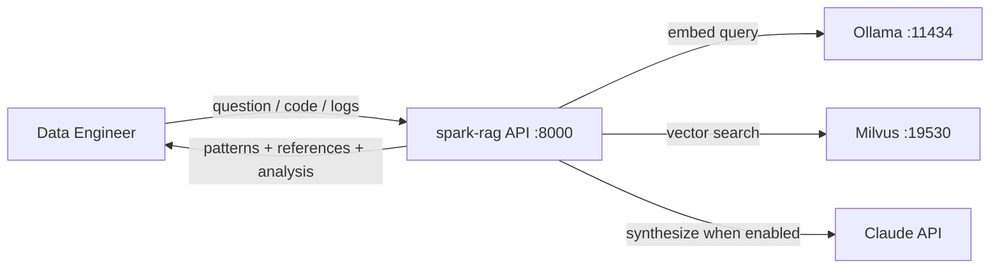
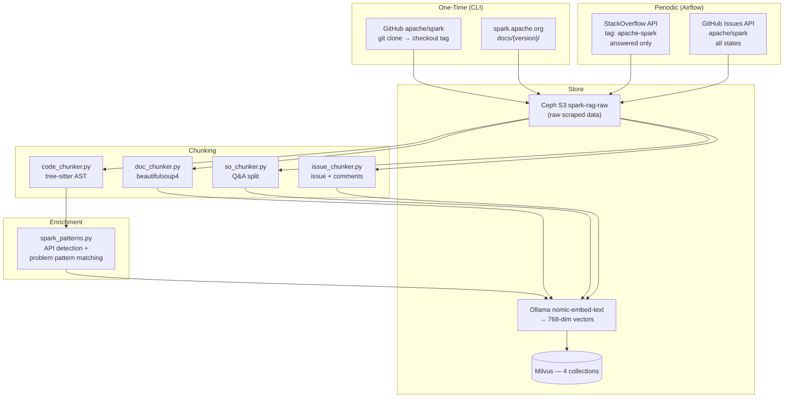
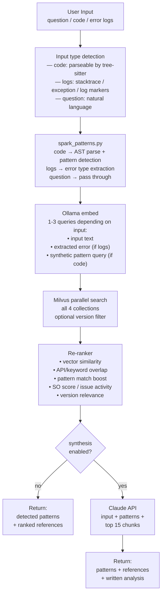
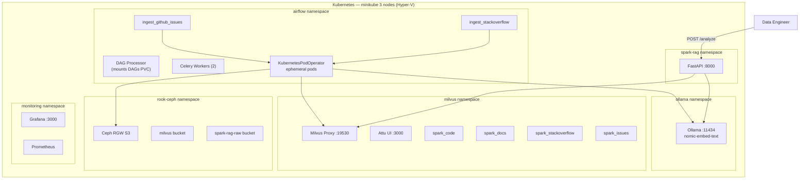

# Architecture

## System Context

spark-rag is a RAG-based Spark expert. It indexes 4 knowledge sources and serves answers via a FastAPI endpoint.



## Ingestion Architecture

Two ingestion modes with different lifecycle:

```
┌─────────────────────────────────────────────────────────────────┐
│ ONE-TIME (CLI scripts, run via uv run)                          │
│                                                                 │
│   uv run python -m spark_rag.ingestion.code --version 4.1.0    │
│   uv run python -m spark_rag.ingestion.docs --version 4.1.0    │
│                                                                 │
│ Bulk ingest of Spark source code and docs per version.          │
│ Run manually when adding a new Spark version.                   │
│ Re-run to fully replace a version's data.                       │
└─────────────────────────────────────────────────────────────────┘

┌─────────────────────────────────────────────────────────────────┐
│ PERIODIC (Airflow DAGs, scheduled)                              │
│                                                                 │
│   ingest_stackoverflow — weekly, incremental                    │
│   ingest_github_issues — daily, incremental                     │
│                                                                 │
│ Check for new/updated content. Deduplicate by source ID.        │
│ Upsert: new items inserted, updated items replaced.             │
│ Runs as KubernetesPodOperator (ephemeral pods).                 │
└─────────────────────────────────────────────────────────────────┘
```

### Ingestion Data Flow



### One-Time Ingestion (Code + Docs)

Plain Python scripts. No orchestration framework needed.

```bash
# Ingest Spark 4.1 source code
uv run python -m spark_rag.ingestion.code --version 4.1.0

# Ingest Spark 4.1 docs
uv run python -m spark_rag.ingestion.docs --version 4.1.0

# Add another version later
uv run python -m spark_rag.ingestion.code --version 3.5.4
uv run python -m spark_rag.ingestion.docs --version 3.5.4
```

Re-ingesting a version deletes existing chunks for that version first, then inserts fresh data.

### Periodic Ingestion (SO + Issues via Airflow)

Airflow DAGs handle incremental sync with deduplication:

| DAG | Schedule | Dedup Strategy |
|---|---|---|
| `ingest_stackoverflow` | Weekly | Upsert by `question_id`. Fetch questions modified since last run. Replace if answer score/accepted status changed. |
| `ingest_github_issues` | Daily | Upsert by `issue_number` + `comment_id`. Fetch issues updated since last run. Replace issue body if edited, add new comments. |

Both DAGs track a **high-water mark** (last sync timestamp) stored in Milvus metadata or a simple state file in Ceph S3. On each run:

1. Fetch items modified after high-water mark
2. For each item: delete existing vectors with matching source ID → insert new chunks
3. Update high-water mark

DAGs use `KubernetesPodOperator` — processing runs in ephemeral pods, not Celery workers.

## Query Pipeline



### Input Type Detection

| Input Type | Detection Signal | Embedding Strategy | Collection Weights |
|---|---|---|---|
| Code | Parseable by tree-sitter, contains Spark API calls | code + synthetic pattern query | code: 0.4, docs: 0.3, SO: 0.2, issues: 0.1 |
| Error logs | Stacktrace, exception class, log level markers | error message + full log context | SO: 0.35, issues: 0.3, docs: 0.2, code: 0.15 |
| Question | Natural language, no code structure | question text | docs: 0.35, SO: 0.3, code: 0.2, issues: 0.15 |

### Version Filtering

- `version` param specified → filter code/docs to that version; boost SO/issues mentioning it
- `version` omitted → uses baseline (4.1.0) for code/docs; SO/issues unfiltered
- `version: "all"` → search all versions (useful for "when did X change?" questions)

### API Response Shape

Same shape in both modes — `analysis` is `null` when synthesis is off:

```json
{
  "input_type": "code",
  "detected_patterns": [
    {"name": "collect_on_large", "risk": "HIGH", "location": "line 12"}
  ],
  "references": [
    {"source": "spark_code", "content": "...", "file_path": "...", "score": 0.92},
    {"source": "spark_docs", "content": "...", "doc_url": "...", "score": 0.87},
    {"source": "spark_stackoverflow", "content": "...", "question_id": 123, "score": 0.85},
    {"source": "spark_issues", "content": "...", "issue_number": 456, "score": 0.80}
  ],
  "analysis": null
}
```

## Deployment Topology



## Resource Estimates

| Resource | Usage |
|---|---|
| Milvus vector data | ~500MB total across 4 collections (HNSW overhead included) |
| Ollama model storage | +274MB for nomic-embed-text |
| FastAPI pod | 500m CPU, 1Gi RAM |
| Ingestion pods (ephemeral) | 1 CPU, 2Gi RAM each |
| Ceph S3 raw data | ~5GB (source + docs HTML + SO JSON + issues JSON) |
| Claude API (when enabled) | ~$0.003-0.01 per query |

## Two Operating Modes

| Mode | Config | What you get |
|---|---|---|
| **Retrieval only** (default) | `synthesis.enabled: false` | Detected patterns + ranked references from all 4 collections |
| **Retrieval + synthesis** | `synthesis.enabled: true` + `ANTHROPIC_API_KEY` | Same + written analysis from Claude with root cause and recommendations |

Synthesis module is swappable:

```
SynthesisProvider (ABC)
├── NoopSynthesis    → returns None (retrieval-only)
└── ClaudeSynthesis  → Claude API (anthropic SDK)
```

## Chunking Strategies

### Code (tree-sitter AST — Scala, Java, Python)

| Chunk Type | What | Size |
|---|---|---|
| method/function | Full method body | Split at ~512 tokens if long |
| class summary | Class name + all method signatures | Table of contents |
| import block | All imports per file | One chunk per file |

Metadata: `file_path`, `language`, `chunk_type`, `qualified_name`, `signature`, `spark_apis` (JSON), `problem_indicators` (JSON).

### Docs (beautifulsoup4 — HTML from spark.apache.org)

| Chunk Type | Split Strategy |
|---|---|
| prose section | Split on heading boundaries, keep heading hierarchy |
| code example | Separate chunk, linked to parent section |
| config table | Separate chunk, key-value pairs |

Metadata: `doc_url`, `doc_section`, `heading_hierarchy`, `content_type`, `related_configs`.

### StackOverflow (API JSON + beautifulsoup4)

| Chunk Type | What |
|---|---|
| question | Title + body |
| answer | Each answer separately |

Filter: only questions with accepted answer OR answer score > 0.

Metadata: `question_id`, `score`, `is_accepted`, `tags`, `error_type`, `spark_apis_mentioned`, `spark_versions_mentioned`.

### GitHub Issues (GitHub API)

| Chunk Type | What |
|---|---|
| issue | Title + body |
| comment | Each comment, linked to parent issue |

All states: open + closed. Comments included.

Metadata: `issue_number`, `state`, `labels`, `author`, `is_comment`, `parent_issue_number`, `created_at`, `closed_at`, `spark_versions_mentioned`, `linked_prs`.

---

## Phase 2: LlamaIndex Migration

Phase 1 (current) uses custom code with direct pymilvus, tree-sitter, and beautifulsoup4 for full control and learning.

Phase 2 replaces the custom plumbing with LlamaIndex, which is purpose-built for RAG pipelines:

| Component | Phase 1 (Custom) | Phase 2 (LlamaIndex) |
|---|---|---|
| Code chunking | Custom tree-sitter parser | `CodeSplitter` (tree-sitter under the hood) |
| Doc/SO/Issue chunking | Custom beautifulsoup4 | Custom `NodeParser` subclasses |
| Embedding client | Direct Ollama HTTP calls | `OllamaEmbedding` |
| Milvus operations | Direct pymilvus | `MilvusVectorStore` |
| Multi-collection search | Custom parallel search + merge | `QueryFusionRetriever` with reciprocal rank fusion |
| Re-ranking | Custom scoring logic | `NodePostprocessor` subclass |
| Incremental sync | Custom high-water mark | `IngestionPipeline` with built-in hash-based dedup |
| Claude synthesis | Direct anthropic SDK | `Anthropic` LLM + `ResponseSynthesizer` |

### Why LlamaIndex for Phase 2

- `CodeSplitter` already does tree-sitter AST-aware splitting — saves ~300 lines of custom code
- `IngestionPipeline` has built-in deduplication (content hash) — exactly what the SO/issues incremental sync needs
- `MilvusVectorStore` exposes more of Milvus's metadata filtering than LangChain's wrapper
- `QueryFusionRetriever` handles multi-retriever fusion with reciprocal rank — replaces custom re-ranker
- `NodePostprocessor` is a clean interface for custom scoring adjustments
- Designed for RAG from the ground up (vs LangChain which is more general-purpose)

### Migration Path

Phase 1 code stays as the reference implementation. Phase 2 is a parallel implementation that:
1. Reuses the same Milvus collections (schema unchanged)
2. Reuses the same config.yaml and synthesis module
3. Replaces `src/spark_rag/chunking/`, `embedding/`, `milvus/`, `ingestion/` internals with LlamaIndex equivalents
4. API layer (`FastAPI`) stays — only the pipeline behind it changes

The test suite validates both phases against the same expected behavior.
