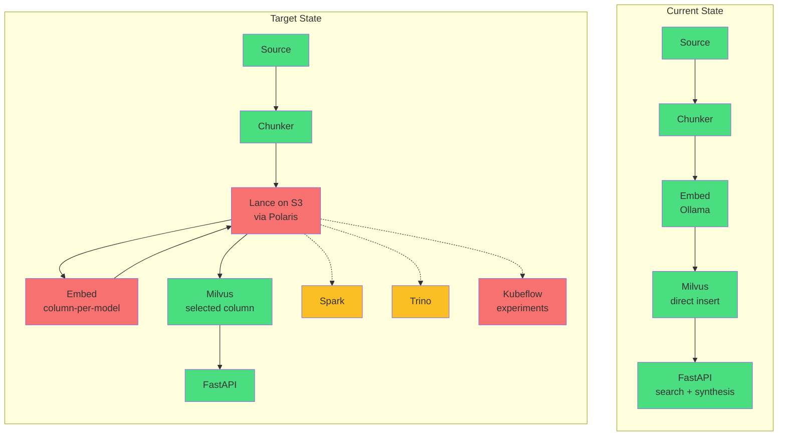
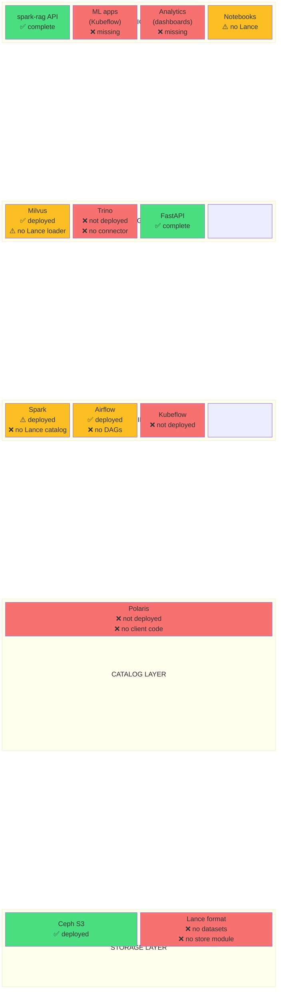
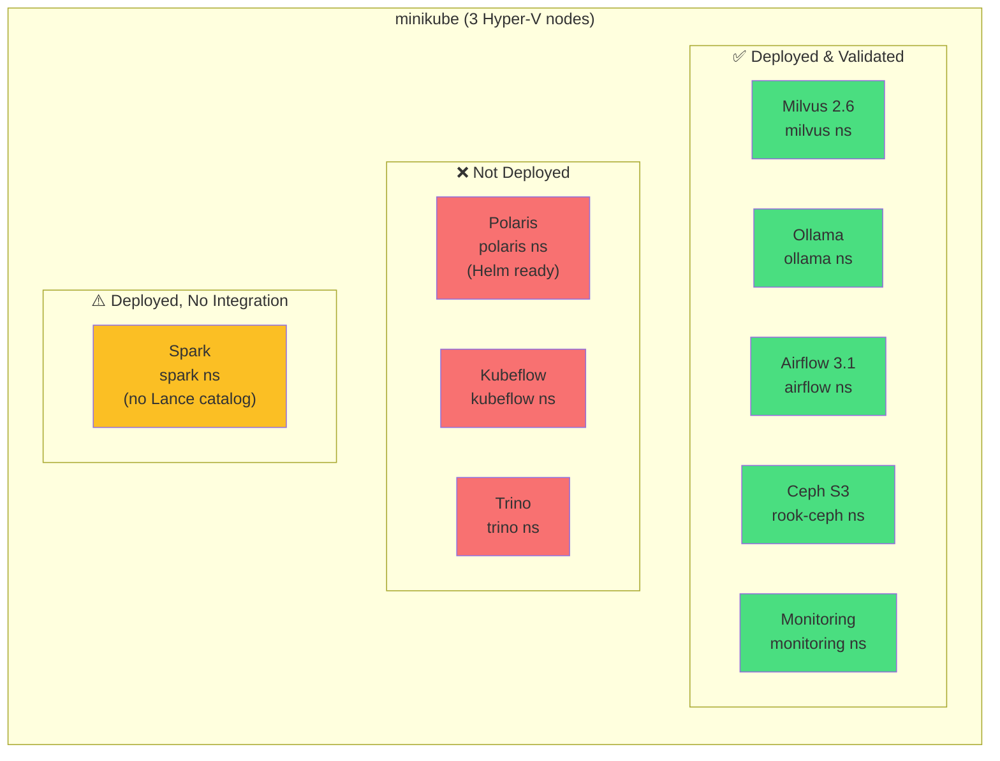
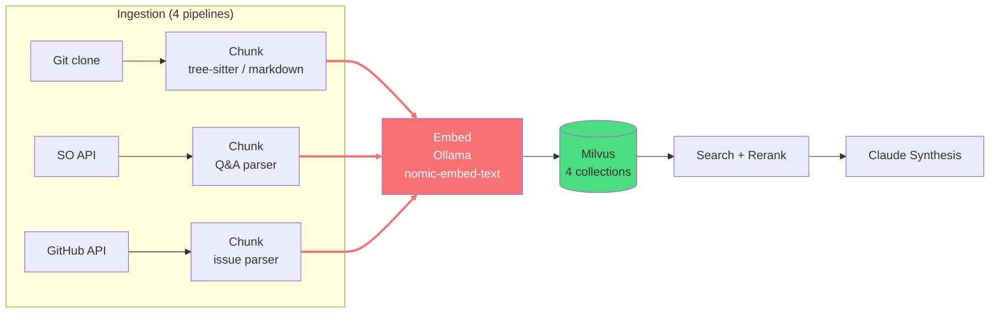
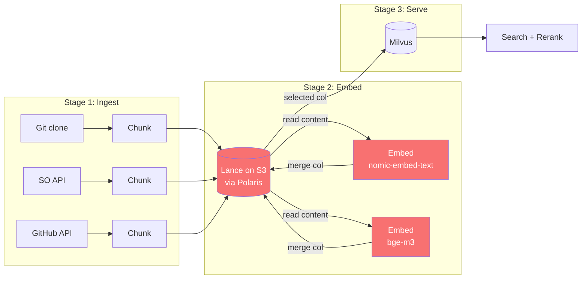
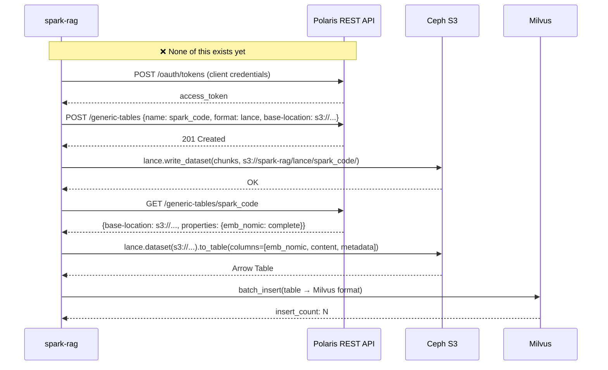
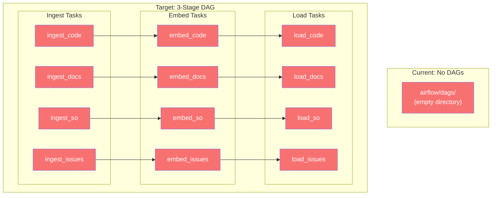
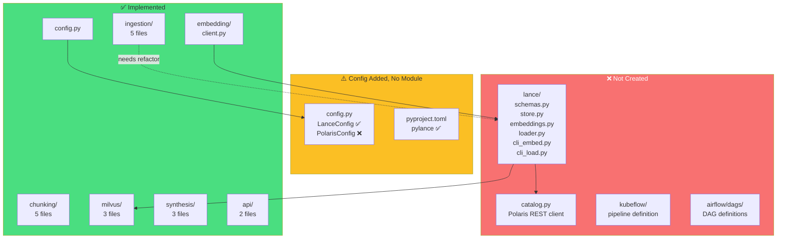
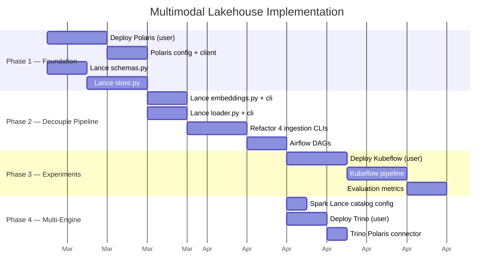
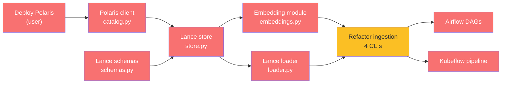

# Multimodal Lakehouse — Gap Analysis

Gap between the current spark-rag implementation and the target multimodal lakehouse architecture.

## Current vs Target Architecture



```
Legend:  🟢 exists   🟡 infra exists, no integration   🔴 not started
```

## Gap by Layer



## Infrastructure Gap



## Data Pipeline Gap

### Current: Tightly Coupled



**Problem**: Changing the embedding model requires re-running the entire pipeline (chunk + embed + insert). ~5-6 hours on CPU for full dataset.

### Target: Three Decoupled Stages



**All red boxes = not implemented yet.**

## Embedding Experiment Gap

```mermaid
flowchart TB
    subgraph CURRENT_EMB["Current: Single Model, No Experiments"]
        TEXT1[content] --> OLL1[Ollama\nnomic-embed-text] --> VEC1["768d vector"]
        VEC1 --> MIL1[(Milvus)]
    end

    subgraph TARGET_EMB["Target: Column-per-Model in Lance"]
        TEXT2[content] --> OLL2[nomic-embed-text] --> COL1["emb_nomic\n768d column"]
        TEXT2 --> BGE2[bge-m3] --> COL2["emb_bge_m3\n1024d column"]
        TEXT2 --> FUT2[future model] --> COL3["emb_xxx\nNd column"]

        COL1 --> LANCE2[(Lance dataset)]
        COL2 --> LANCE2
        COL3 --> LANCE2

        LANCE2 --> |select best| MIL2[(Milvus)]

        LANCE2 -.-> KF[Kubeflow\nrecall@k evaluation]
        KF -.-> |promote winner| MIL2
    end

    style OLL1 fill:#4ade80
    style MIL1 fill:#4ade80
    style LANCE2 fill:#f87171,color:#fff
    style KF fill:#f87171,color:#fff
    style COL1 fill:#f87171,color:#fff
    style COL2 fill:#f87171,color:#fff
    style COL3 fill:#f87171,color:#fff
```

## Polaris Catalog Integration Gap



## Airflow DAG Gap



## Code Module Gap



## Gap Summary

| Component | Layer | Status | What Exists | What's Missing |
|---|---|---|---|---|
| **Lance store** | Storage | ❌ | config added, pylance dep added | `lance/` module (6 files): schemas, store, embeddings, loader, 2 CLIs |
| **Polaris catalog** | Catalog | ❌ | nothing | config, REST client, OAuth, table registration |
| **Polaris deploy** | Infra | ❌ | Helm chart ready | K8s deployment (user handles) |
| **Ingestion refactor** | Processing | ⚠️ | 4 CLIs work (chunk→embed→Milvus) | Decouple: chunk→Lance, embed→Lance, load→Milvus |
| **Airflow DAGs** | Processing | ❌ | empty `dags/` dir, Airflow deployed | DAG definitions for 3-stage pipeline |
| **Kubeflow** | Processing | ❌ | nothing | deploy + pipeline definition + metrics |
| **Spark catalog** | Processing | ⚠️ | Spark deployed | Lance catalog connector config |
| **Trino connector** | Serving | ❌ | nothing | deploy + Polaris catalog connector |
| **Milvus loader** | Serving | ⚠️ | Milvus works, ingest functions exist | `lance/loader.py` to read Lance → Milvus |
| **FastAPI** | Application | ✅ | complete | none |
| **Ceph S3** | Storage | ✅ | deployed, validated | none |

## Implementation Phases



## Critical Path



**Blocking dependency**: Polaris deployment must happen first — everything else discovers tables through the catalog.

**Parallel tracks after Polaris**: Lance schemas + Polaris client can start together, then store, then embedding + loader in parallel, then ingestion refactor.
